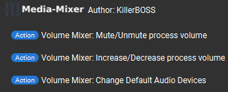
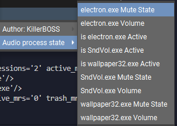
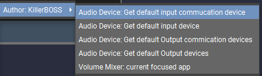

# TouchPortal-Windows-MediaMixer
a TouchPortal plugin that allows you to control Window's default audio mixer.

- [TouchPortal-Windows-MediaMixer](#touchportal-windows-mediamixer)
- [Change Log](#change-log)
- [What is this?](#what-is-this)
- [Functionality](#functionality)
    - [Action](#action)
    - [State](#state)
- [Versioning](#versioning)
- [Lincense](#license)
- [Bugs/Echancements](#bugsenhancements)

# Change Log
```
v1.1.0 - Device Output & bug fixes (5/29/2022)
    Whats added?
        - Action
            - Volume Mixer: Change Default Audio Devices
        - State
            - Audio Device: Get default Output devices
            - Audio Device: Get default Output commication devices
            - Audio Device: Get default input device
            - Audio Device: Get default input commucation device
    Bug fixes:
        - Plugin does not delete expired application state
    
    Known error:
        to my experice plugin randomly crashes (currently debugging this)


v1.0.0 - InitialRelease (5/26/2022)
   Features:
      - Mute/Unmute/Toggle per application
      - Increase/Decrease/Set Master vol, current focused app or app you choose.
      - Using slider to control each application's volume

```

# What is this?
Have you ever wondering if theres a way to easily control Windows Volume Mixer without using third party software like voicemeter? You found the right place! Because this uses Windows buildin API which allows you to change individual Application volume in tip of finger!

# Functionality

## Action


- Volume Mixer: Mute/Unmute process volume
    - This allows you to Toggle/Mute/Unmute any program you pick.
- Volume Mixer: Increase/Decrease process volume
    - It allows you to Increase/Decrease/Set any application Volume
- Volume Mixer: Change Default Audio Devices
    - This allows you to change your Commucation or Default device for both Input or output

## State



This plugin will create for each application
- appname.exe Mute state
   - This gives `Muted` or `Un-muted` depends on application
- is appname.exe Active
    - This gives `True` or `False` It will show `True` if application is playing sound
- appname.exe Volume
    - This shows this application's volume
- Audio Device: Get default Output devices
    - This shows your current Default output device
- Audio Device: Get default Output commication devices
    - This shows your Default output commication device
- Audio Device: Get default input device
    - This shows your default input device
- Audio Device: Get default input commucation device
    - This shows your default input commucation device
- Volume Mixer: current focused app
    - This gives you current focused app

### Slider

This plugin also includes slider functionality. to use this feature simply change button type to `Slider` then you will have
- Volume Mixer: APP Volume slider

# Versioning

We use [SemVer](http://semver.org/) for versioning. For the versions available, see the Releases section

# License

This project uses [GNU GPL v3.0](LICENSE)

# Bugs/Enhancements
Use the Github Issues tab to report any bugs/enhancements for this plug-in. Or mention them in the Official Touch Portal discord channel #win-mediamixer
